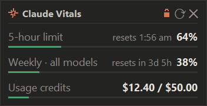
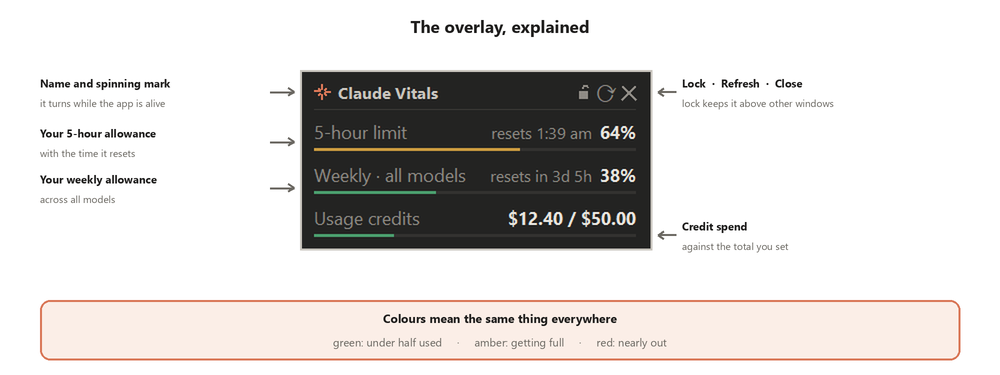
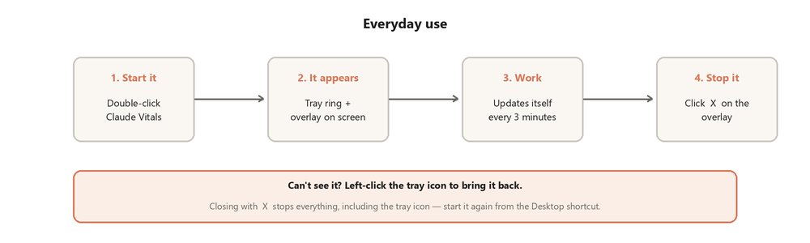
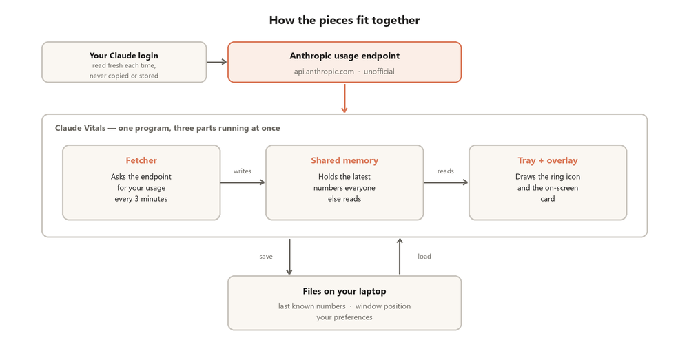
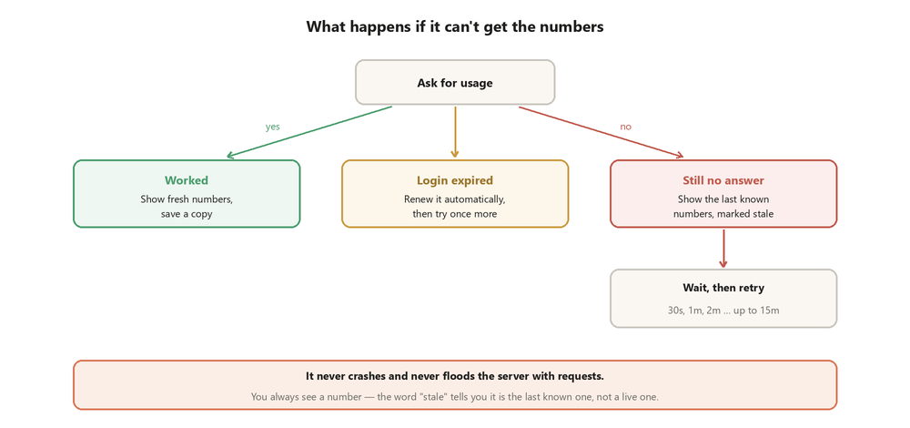

# Claude Vitals

**See how much Claude you have left, without leaving your conversation.**

Claude Code shows your usage in a built-in panel. The ordinary Chat tab doesn't —
to see the same numbers you have to stop, open Settings, and click through to
Usage. Claude Vitals puts them on screen instead: a small always-on-top card and
a colour-coded tray icon.

<p align="center">
  
</p>

> ⚠️ **This is a personal side project. It is not affiliated with, endorsed by,
> or supported by Anthropic.** It reads an undocumented endpoint that Anthropic
> has never published and could change or remove at any time — if that happens,
> Claude Vitals will stop showing live numbers. Use it at your own risk.
> "Claude" is a trademark of Anthropic; this project just talks to it.

---

## Why this exists

I kept running into the same small annoyance. Mid-conversation, I'd wonder how
much of my allowance was left — and the only way to find out was to stop, open
Settings, click through to Usage, read a number, and come back. Over and over,
several times a day. Claude Code shows this in a panel right there; the Chat tab
just doesn't.

So I built the thing I wanted: the number always visible, never in the way, and
never something I have to go looking for.

**Built with Claude Code — vibecoded**, over a handful of sessions. That said,
it isn't a throwaway: the tricky parts (never stealing focus, surviving outages,
never leaking your token) were worked through deliberately, the code is
commented, and there's a test suite you can run yourself. But it's a side
project by one person, not production software — please read the safety notes
below rather than assuming.

---

## Does this work for me?

| | |
|---|---|
| **Operating system** | Windows 10 or 11 only. No macOS or Linux build. |
| **Claude plan** | **Pro, Max, Team, or API credits.** |
| **Not supported** | **The free Claude plan.** See below. |
| **Python** | 3.10 or newer |

**Why the free plan can't work:** Claude Vitals reads the login that Claude Code
stores on your machine, and Claude Code requires a paid plan. On the free plan
that login never exists, so there is nothing for Claude Vitals to authenticate
with. If you launch it anyway it will tell you this in plain language rather
than failing silently.

You also need to have signed in to Claude Code at least once — see
[Installation](#installation) step 3.

---

## What it does



**A card on screen** showing your 5-hour allowance, your weekly allowance, and
your credit spend. Each row has a thin bar that's green under 50%, amber to 80%,
and red above.

**A tray icon** — a ring showing the current percentage, in the same colours.
Hover for both allowances with countdowns to reset.

**It stays out of your way:**

- **It never steals focus.** You can keep typing in Claude while it appears,
  updates, or you click its buttons. This is the whole reason it's usable.
- **Lock / unlock.** Locked, it floats above everything. Unlocked, ordinary
  windows — a fullscreen video, say — can cover it. Your choice is remembered.
- **It's not in Alt-Tab or the taskbar.** It's a tray app, not a window.
- **Drag it anywhere.** It remembers where you put it.

**It's honest when it doesn't know.** If a check fails you get the last known
numbers clearly marked `stale`, never a stale number pretending to be live.

**Costs almost nothing:** about 0.3% of one CPU core and ~55 MB of memory.

---

## Installation

1. **Install Python 3.10 or newer** from [python.org](https://www.python.org/downloads/)
   if you don't have it. Tick **"Add python.exe to PATH"** during installation.

2. **Download this repository** — green *Code* button → *Download ZIP* → unzip
   it somewhere permanent (not your Downloads folder).

3. **Sign in to Claude Code**, if you never have. Open a terminal and run:

   ```
   claude setup-token
   ```

   This is what creates the login Claude Vitals reads. You only do it once.

4. **Double-click `setup.bat`.** It creates a private Python environment,
   installs the dependencies, and adds Desktop and Start-menu shortcuts. It
   changes nothing outside this folder.

5. **Start it** from the Desktop icon.

---

## Using it



### Starting and stopping

| | |
|---|---|
| **Start** | Desktop icon, Start menu (type "Claude Vitals"), or `start.bat` |
| **Start automatically** | Tray menu → *Start with Windows* |
| **Stop** | The **✕** on the card, or tray → *Quit* |

**✕ stops everything**, including the tray icon — so to start again, use the
Desktop shortcut. To put the card away without stopping, untick *Show overlay*
in the tray menu instead.

### The three buttons

| Button | What it does |
|---|---|
| 🔒 **Lock** | Orange padlock: always on top. Grey open padlock: other windows can cover it. |
| ⟳ **Refresh** | Check now instead of waiting for the next automatic check. |
| ✕ **Close** | Stop everything. |

### Lost it?

If it's unlocked, something may be covering it. **Left-click the tray icon** to
bring it straight back — that's the tray's default action. It won't re-lock it
and won't steal your focus.

### Tray menu

| Option | What it does |
|---|---|
| Bring overlay to front | Surface the card. Also the left-click action. |
| Refresh now | Check immediately. |
| Lock on top | Same as the padlock. |
| Show overlay | Hide the card, keep checking in the background. |
| Usage alerts (80% / 95%) | Windows pop-ups at those thresholds. **Off by default.** |
| Always visible | On: always shown. Off: shown only while the Claude app is focused. |
| Set usage credits total… | See below. |
| Start with Windows | Launch at login. |
| Quit | Stop everything. |

---

## Usage credits

If your account has usage credits, the third row shows what you've spent.

Claude's API reports what you have **spent**, but not your **balance** or the
**total you were granted** — those come back empty unless your account has a
monthly spend cap set. So most people need to tell Claude Vitals the total once:

**Tray menu → *Set usage credits total…***

Find the figure in Claude under **Settings → Usage**: add the *amount spent* to
your *current balance*. Enter that. The spent side stays live from the API, so
the row keeps itself up to date afterwards.

Leave it blank and the row simply shows the amount spent, with no bar. If your
account *does* expose a spend cap, it's picked up automatically and you never
need to touch this.

> Credits expire. If yours were promotional, update the total when they lapse or
> when you top up.

---

## Privacy and security

Please read this rather than taking it on trust — it's a small program and you
can verify every claim below in a few minutes.

### What it changes on your machine

Three things, and nothing else:

1. **It can rewrite `~/.claude/.credentials.json`.** This is the most
   consequential thing it does, so it deserves a clear explanation. Your Claude
   login expires roughly every 8 hours, and the desktop app doesn't refresh that
   file — so Claude Vitals renews it using the refresh token already stored
   there. **It copies the file to `.credentials.json.bak` first** and writes the
   replacement atomically, so an interrupted renewal can't leave you with a
   truncated file. Worst realistic case: the renewal fails and you sign in again
   with `claude setup-token`.
2. **Shortcuts** in your Start menu, on your Desktop, and — only if you ask for
   it — in your Startup folder. All plain `.lnk` files you can delete.
3. **If you install the optional status line**, two entries under `~/.claude`
   (the script itself, and a `statusLine` key in `settings.json`). Your existing
   settings are backed up first and merged, never overwritten.

Everything else it writes stays inside this folder.

### What leaves your machine

- **Exactly two addresses, both Anthropic's**, and you can grep the source to
  confirm it: `api.anthropic.com/api/oauth/usage` to read your usage, and
  `console.anthropic.com/v1/oauth/token` to renew your login.
- **One request every 3 minutes.** No server of ours, no analytics, no
  telemetry, no third party, nothing listening for incoming connections.
- **Your login is read fresh from disk per request**, used, and discarded. It is
  never copied into the app's own files, never logged, and never printed. Error
  messages are scrubbed before display, and the credential object's `repr` is
  overridden so a token can't leak through a stack trace.
- **What's stored locally**, all inside this folder and all deletable:
  `state/usage_cache.json` (last known figures), `state/ui_state.json` (window
  position and toggles), `state/settings.json` (your credit total).
- **`.gitignore` covers** credential files, the whole `state/` folder, and the
  virtual environment — so none of it can be committed by accident.

`tools/test_failure_paths.py` asserts the redaction behaviour, and the whole
thing is a few hundred lines of readable Python.

### Honest limitations

I'd rather set expectations properly than claim this is bulletproof:

- **It's a side project, not audited software.** MIT licence, no warranty. Read
  the code — that's a realistic thing to do here, and it's the best assurance
  anyone can give you.
- **It has dependencies** — `pystray`, `Pillow`, `requests`, `pywin32`. Versions
  are pinned, but installing anything from PyPI carries the usual supply-chain
  risk, same as any Python project.
- **The endpoint is undocumented.** Anthropic never published it and hasn't
  endorsed automated polling of it. Three minutes between requests is modest and
  far below anything you'd do by refreshing the Settings page, but you should
  make your own judgement about using an unofficial API with your account.
- **It can't work at all on the free plan**, and it's Windows-only.
- **Bugs are possible.** The tests cover the paths I could think of, including
  outages, expired logins and malformed responses — they don't prove absence.

---

## Troubleshooting

| Symptom | What's happening |
|---|---|
| **A dialog says it can't find your Claude login** | You've never run `claude setup-token`, or you're on the free plan (not supported). |
| **A dialog says your login expired** | Run `claude setup-token` again. The desktop app signs in separately and doesn't refresh this file. |
| **Tray shows a grey dash** | It can't reach the endpoint. Try *Refresh now*; if it persists, the endpoint may have changed. |
| **The card never appears** | Check the tray icon exists, then left-click it. |
| **It vanished behind a video** | It's unlocked. Left-click the tray icon, or click the padlock. |
| **The card is off-screen** | Delete `state/ui_state.json` to reset its position. |
| **It doesn't follow my Claude window** | Run `tools\probe_foreground.py 6` to see what your Claude app is called, then add that name to `extra_claude_processes` in `state/settings.json`. |

---

## Uninstalling

Everything comes out independently, and nothing is left behind.

| | |
|---|---|
| **Stop it** | Tray → *Quit* |
| **Start with Windows** | Untick it in the tray menu |
| **Shortcuts** | `.venv\Scripts\python.exe install_shortcuts.py --uninstall` |
| **Status line** (if installed) | `python statusline\install.py --uninstall` |
| **Everything else** | Delete this folder |

Outside this folder, Claude Vitals only ever creates the shortcuts above and —
if you installed the status line — two entries in `~/.claude`.

---

## Optional: the Claude Code status line

`statusline/` adds a two-line status line to Claude Code in a terminal, showing
model, context and rate limits. Install with:

```
python statusline\install.py
```

> **It will not appear in the Claude desktop app.** The desktop app's Claude Code
> interface has no status-line renderer — it's a terminal feature. It works when
> you run Claude Code in an actual terminal window.

This part makes no network requests; Claude Code hands it the data directly.

---

## How it works



One program doing three things at once: a **fetcher** that asks the endpoint for
your usage every 3 minutes, **shared memory** holding the latest numbers, and the
**tray and overlay** that draw them. Splitting it this way means the display
never waits on the network.

When a check fails, it falls back to the last cached numbers marked `stale`, and
retries on a widening gap (30s, 1m, 2m … capped at 15m) so it never hammers the
server. If your login is rejected it re-reads the file, then renews the token
automatically — backing up the original first.



### Project layout

```
run.pyw                 entry point (checks your Python version first)
setup.bat               one-click first-time setup
claude_usage/
  config.py             paths, thresholds, palette
  settings.py           user settings (state/settings.json)
  credentials.py        reads and renews the OAuth token; redaction
  usage.py              fetches and normalises the endpoint response
  cache.py              last-good snapshot and UI state
  poller.py             the single poll loop, backoff, alert de-duplication
  tray.py               tray icon, tooltip, menu
  overlay.py            the frameless always-on-top card
  dialogs.py            settings and first-run help dialogs
  win32.py              foreground detection, focus-safe windows, shortcuts
  app.py                thread wiring
statusline/             optional Claude Code status line
tools/                  diagnostics and tests, all runnable standalone
docs/                   screenshots, diagrams, and the full documentation
```

### Running the tests

```
.venv\Scripts\python.exe tools\test_parse.py          # parsing, incl. hostile input
.venv\Scripts\python.exe tools\test_failure_paths.py  # outages, auth recovery, redaction
.venv\Scripts\python.exe tools\test_settings.py       # settings, dialogs, credit totals
.venv\Scripts\python.exe tools\test_lock.py           # lock, bring-to-front, buttons
.venv\Scripts\python.exe tools\test_visibility.py     # follow-Claude visibility
.venv\Scripts\python.exe tools\verify_overlay.py      # window flags and focus safety
.venv\Scripts\python.exe tools\smoke_test.py          # icons, one live poll, backoff
.venv\Scripts\python.exe tools\measure_cost.py        # CPU and memory
python statusline\test_statusline.py                  # status line, mocked input
```

Regenerating the images in `docs/`, if you change how the overlay looks:

```
.venv\Scripts\python.exe tools\make_demo_shot.py      # the still, with invented numbers
.venv\Scripts\python.exe tools\make_demo_gif.py       # the animated demo
.venv\Scripts\python.exe docs\make_diagrams.py        # the explanatory diagrams
```

---

## Contributing

Issues and pull requests are welcome, but this is a side project maintained in
spare time — please don't expect fast responses. The most useful contributions
would be macOS or Linux support (the Windows-specific parts are confined to
`win32.py`), or reports of what the endpoint returns on Max and Team accounts.

---

## Licence

[MIT](LICENSE) — do what you like with it, no warranty.

**Again, clearly:** this is an unofficial personal project with no connection to
Anthropic. It depends on an undocumented API that may break without notice.
